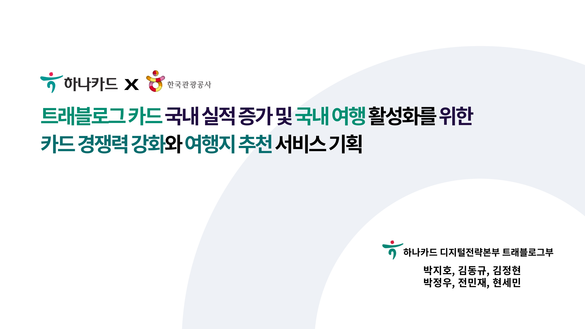
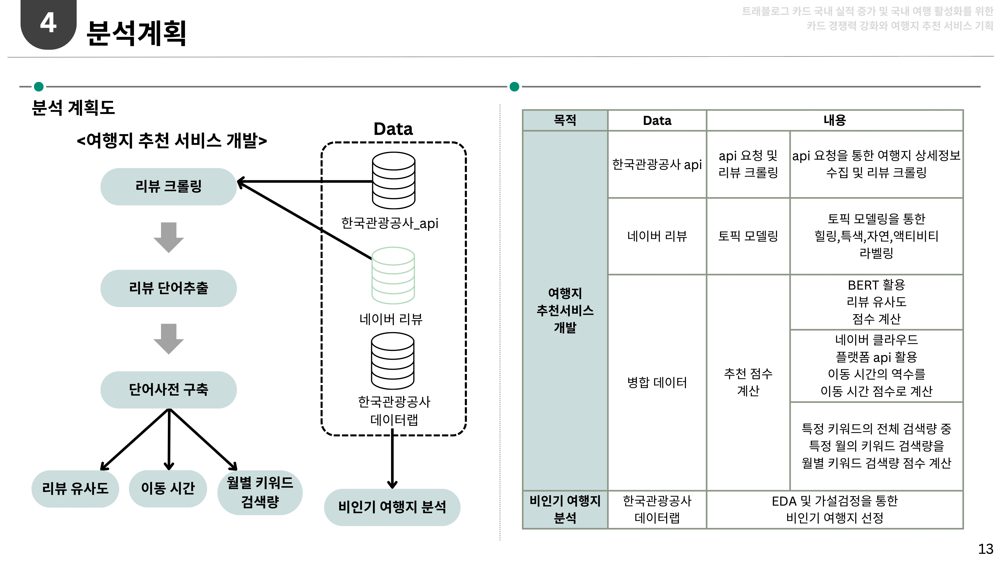
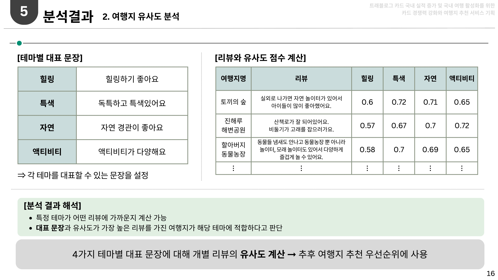
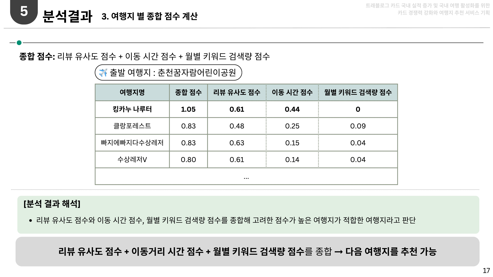
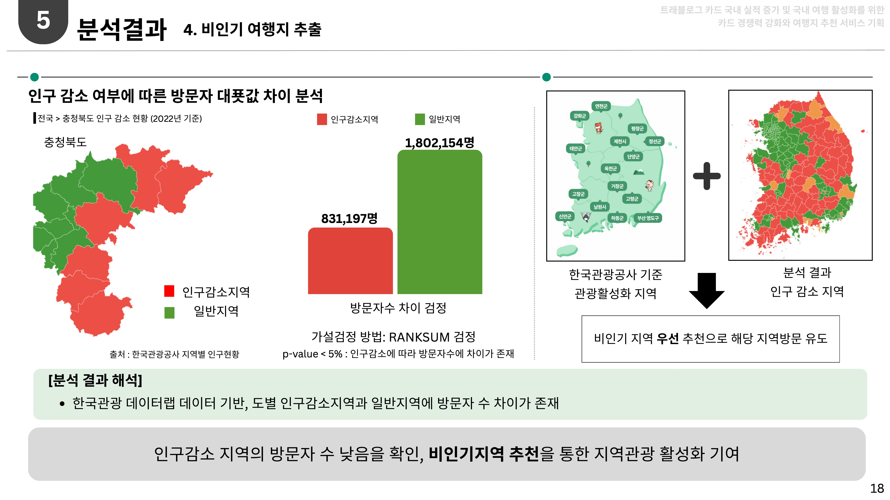
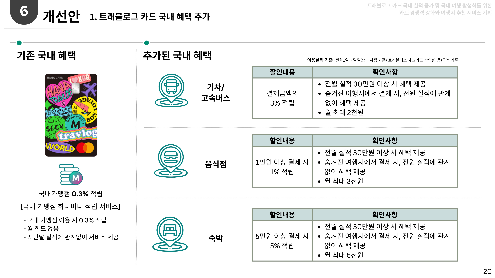

***<디지털하나로 2기_2차 프로젝트_TEAM.파워레인저 : 1등🥇>***

# [하나카드x한국관광공사] 트래블로그 카드 국내 실적 증가 및 국내 여행 활성화를 위한 카드 경쟁력 강화와 여행지 추천 서비스 기획
- 하나카드의 주력 상품인 `트래블로그의 국내 실적 증가` 및 `국내여행 활성화`를 위한 한국관광공사와 협업 및 서비스 기획 제안
<!--프로젝트 대문 이미지-->

<!--기술스택-->
> #### ⚙️ Stack & Tool
>    
>  

<!--프로젝트 버튼-->
> #### 🔗 프로젝트 자료
>|여행지 추천 서비스 (프로토타입)|최종 발표자료|
>|:---:|:---:|
>|[![View 프로토타입)][view-prototype-shield]][view-prototype-url]|[![View 발표자료][view-pdf-shield]][view-pdf-url]|

 

<!--목차-->
# 💬 목차
1. [⚡️팀 소개](#1-팀-소개)
     + 1.1 팀원 소개
             
2. [📆프로젝트 일정](#2-프로젝트-일정)
    + 2.1 프로젝트 기간
    + 2.2 프로젝트 단계
    + 2.3 프로젝트 세부일정
       
3. [🖍️프로젝트 목표 및 추진배경](#3-프로젝트-목표-및-추진배경)
    + 3.1 프로젝트 목표
    + 3.2 프로젝트 추진배경
      
4. [📊데이터 분석](#4-데이터-분석)
   + 4.1 수집 데이터
   + 4.2 데이터분석 기법
   + 4.3 변수 정의서
   + 4.4 데이터분석 계획
     
5. [✅데이터분석 결과](#5-데이터분석-결과)

6. [💡개선안](#6-개선안)
  
  	

<!--1.팀 소개-->
## 1. 팀 소개
- 저희 **파워레인저**는 하나은행 디지털하나로 2기(데이터분석 및 서비스기획) 2차 프로젝트를 수행하기 위해 구성된 팀입니다!

	### 1.1 팀원 소개
	|이름|역할|업무|Github 링크|
	|:---:|:---:|:---:|:---|
	|❤️박지호|팀장|데이터분석|[@owlgho](https://github.com/owlgho)|
	|💙김동규|팀원|데이터분석|[@hanakdg98](https://github.com/hanakdg98)|
	|🩷김정현|팀원|데이터분석|[@kjhz2](https://github.com/kjhz2)|
	|🤍박정우|팀원|데이터분석|[@weturnit42](https://github.com/weturnit42)|
	|🖤전민재|팀원|데이터분석|[@espressotheblack](https://github.com/espressotheblack)|
	|💛현세민|팀원|데이터분석|[@semni-29](https://github.com/semni-29)|

  

<!--2. 프로젝트 일정-->
## 2. 프로젝트 일정
  ### 2.1 프로젝트 기간 : 2024.4.22. ~ 2024.5.3. (총 12일 소요)
  ### 2.2 프로젝트 단계
  - 주제선정 → 기획 → 데이터수집 및 전처리 → 데이터 분석 → 개선안 도출 → 최종발표
  ### 2.3 프로젝트 세부 일정

|기간|세부내용|
|---|---|
|2024.04.22 ~ 04.24|주제 선정 및 프로젝트 일정 수립, 기획서 작성|
|2024.04.24|중간 발표(기획)🎤|
|2024.04.24 ~ 04.26|데이터 수집 및 전처리, EDA 수행|
|2024.04.26 ~ 04.30|데이터 분석 및 분석결과 도출|
|2024.04.30|중간 발표(데이터분석 결과)🎤|
|2024.04.30 ~ 05.01|인사이트 및 개선안 도출|
|2024.05.01 ~ 05.02|프로토타입 제작 및 최종 발표자료 완성|
|2024.05.03|최종 발표🎤|

  

<!--3. 프로젝트 배경-->
## 3. 프로젝트 목표 및 추진배경
  ### 3.1 프로젝트 목표
  - `트래블로그 카드의 국내 혜택 개선 및 국내 여행지 추천 서비스를 통해 지역사회 기여 등 사회적 가치 창출과 하나카드의 국내 실적 증가`를 위해 프로젝트를 진행하였습니다.
	
  ### 3.2 프로젝트 추진배경
  - (1) 하나카드는 해외 구매 실적에서는 1위지만, 국내 구매 실적에서는 하위권에 위치함
  - (2) 2020년 이후, 국내 여행의 횟수가 전년 대비 4.3% 증가하며, 지속적으로 국내 여행이 증가하는 추세를 보임
  - (3) 2030년 이후 모든 상장사는 ESG 현황 공시 의무와 대내외적으로 금융사에 대한 ESG 요구 증가함에 따라 ESG 필요성 증대

  

<!--4. 데이터 분석-->
# 4. 데이터 분석
  ### 4.1 수집 데이터
  - 수집데이터 목록 [(상세보기)](link)
     - 한국관광공사
     - 문화빅데이터 플랫폼
     - 네이버지도
     - 네이버검색트렌드
     - 하나금융그룹 보고서

  ### 4.2 데이터분석 기법
  - 데이터수집
  - 데이터 전처리
  - 가설검정, 통계
  - ...

  ### 4.3. 변수 정의서
  

  ### 4.4. 데이터분석 계획
  

  

<!-- 5. 데이터분석-->
# 5. 데이터분석 결과

  
<!--6. 개선안-->
# 6. 개선안

 <!--Url for Buttons-->
[view-prototype-shield]:https://img.shields.io/badge/view-prototype-F24E1E.svg?style=for-the-badge&logo=figma&logoColor=white
[view-prototype-url]: https://www.figma.com/proto/Sbyt9LswA1J1arGg5ipxGN/%ED%8C%8C%EC%9B%8C%EB%A0%88%EC%9D%B8%EC%A0%80_2%EC%B0%A8%ED%94%84%EB%A1%9C%EC%A0%9D%ED%8A%B8(%ED%95%98%EB%82%98%EC%B9%B4%EB%93%9Cx%ED%95%9C%EA%B5%AD%EA%B4%80%EA%B4%91%EA%B3%B5%EC%82%AC)_v0.1?page-id=2008%3A809&node-id=2024-47&starting-point-node-id=2024%3A47&t=WwuZdxT7CvR9dhpg-1
[view-pdf-shield]:https://img.shields.io/badge/view-%EB%B0%9C%ED%91%9C%EC%9E%90%EB%A3%8C-EC1C24.svg?style=for-the-badge&logo=adobeacrobatreader&logoColor=white
[view-pdf-url]:https://github.com/SeminHyun/digital-hanaro-power-rangers/blob/main/%E1%84%83%E1%85%B5%E1%84%8C%E1%85%B5%E1%84%90%E1%85%A5%E1%86%AF%E1%84%92%E1%85%A1%E1%84%82%E1%85%A1%E1%84%85%E1%85%A92%E1%84%80%E1%85%B5_%E1%84%91%E1%85%A1%E1%84%8B%E1%85%AF%E1%84%85%E1%85%A6%E1%84%8B%E1%85%B5%E1%86%AB%E1%84%8C%E1%85%A5_%E1%84%87%E1%85%A1%E1%86%AF%E1%84%91%E1%85%AD%E1%84%8C%E1%85%A1%E1%84%85%E1%85%AD_Final.pdf
